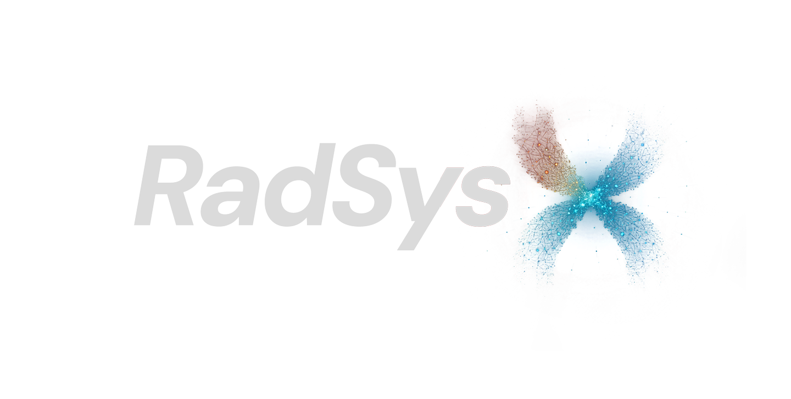

<p align="center">
  
</p>

<h1 align="center">RadSysX</h1>

<p align="center">
  Governed clinical imaging workflows, research experimentation, and agent-assisted medical reasoning.
</p>

RadSysX is a medical imaging and analysis platform with two distinct product surfaces:

- `clinical`: the governed migration target, built around FastAPI contracts, worklist-driven launch, opaque viewer sessions, audited workflow state, and a dedicated OHIF viewer runtime.
- `research`: the experimentation surface for prototype workflows, a LangGraph/deepagents-based multi-agent stack, MCP/FHIR integrations, and imaging/AI exploration that is explicitly not the clinical source of truth.

The two surfaces are not interchangeable.
The repo also includes an Electron desktop fast path that opens directly into OHIF local DICOM mode and runs the local clinical shell without the Docker/nginx/Orthanc composition required for full governed archive validation.

## Platform Overview

The current repo contains both:

- a governed clinical platform with backend-authoritative workflow state and OHIF as the only supported clinical viewer
- a research stack with direct chat, multi-agent orchestration, MCP tool integration, and BiomedParse-oriented imaging/AI experimentation

That distinction is intentional. The clinical path is the migration target; the research path remains useful, but it does not define clinical architecture.

## Current State

The current clinical baseline on this branch is:

- FastAPI is the backend authority for clinical auth, launch, workspace, report, AI, derived-result, and audit workflows.
- OHIF is the only supported clinical viewer runtime.
- The old Next.js `/viewer` fallback route is removed.
- Backend-issued signed cookies provide local seeded clinical identity until institutional auth replaces them.
- Derived DICOM writeback stays backend-mediated through STOW.
- The local stack is designed to run as one origin through nginx, frontend, viewer, backend, and Orthanc.
- The OHIF app exposes `/viewer/fhir-viewer` for FHIR R4 ImagingStudy/DocumentReference discovery and SMART on FHIR EHR launch with PKCE.
- The desktop app starts FastAPI, Next.js, and a local OHIF viewer bridge under one localhost origin for a no-Docker local run path, opening OHIF first with local import ready, keeping the visible app name as RadSysX, and including a frontend-only RadSysX AI chat panel in the OHIF right sidebar.
- The desktop app enables native local file/folder selection plus browser drag-and-drop fallback for backend-owned local imaging import of DICOM, DICOMDIR, NIFTI `.nii`/`.nii.gz`/paired `.hdr+.img`, NRRD `.nrrd`, ZIP archives containing supported files, and common image files, with safe imported-study asset summaries, backend-mediated NIFTI slice previews/common-image previews including TIFF SVG header previews, NRRD header/voxel metrics, and deterministic technical analysis for local analysis readiness.

The current research/agent baseline still includes:

- `backend/radsysx.py` for multi-agent orchestration
- `backend/chat_interface.py` for direct LLM chat
- `backend/mcp/*` for MCP/FHIR tooling and server installation
- `backend/biomedparse_api.py` for research imaging analysis APIs

Those capabilities remain part of RadSysX, but they are not the clinical source of truth.

## Clinical Workflow

1. `POST /api/auth/local-login`
2. `GET /api/auth/session`
3. Open `/worklist`
4. `POST /api/imaging/launch`
5. Open `/viewer/?launch=...`
6. `GET /api/imaging/launch/resolve`
7. OHIF binds to the returned runtime and same-origin DICOMweb roots
8. `GET /api/studies/{studyUid}/workspace`
9. Persist reports, AI jobs, derived results, and audit through backend contracts
10. Persist uploaded derived DICOM through `POST /api/derived-results/stow`

## FHIR Viewer

`/viewer/fhir-viewer` is a separate SMART on FHIR entry into the RadSysX OHIF shell. A standard EHR launch supplies opaque `iss` and `launch` parameters; the public SMART client ID comes from `RADSYSX_FHIR_CLIENT_ID` at viewer build time or a `client_id` launch parameter. The FHIR server remains the metadata authority and must allow the RadSysX browser origin through CORS.

The route resolves FHIR R4 `ImagingStudy` and `DocumentReference` resources into OHIF studies while keeping access tokens in session storage. Do not place patient identifiers, FHIR payloads, or access tokens in its URL. SMART authorization does not create a governed RadSysX session, so report persistence, audit, derived-result writeback, and STOW remain unavailable until an explicit backend contract connects those authorities.

Optional viewer-build settings are:

- `RADSYSX_FHIR_SERVER_URL`
- `RADSYSX_FHIR_CLIENT_ID`
- `RADSYSX_FHIR_SCOPE` (defaults to `launch openid fhirUser patient/*.read`)

## Architecture

### Clinical authority

- `backend/server.py`
- `backend/clinical/*`
- `backend/clinical/local_imaging.py`
- `backend/tests/test_clinical_platform.py`

### Research and agent stack

- `backend/radsysx.py`
- `backend/chat_interface.py`
- `backend/mcp/*`
- `backend/biomedparse_api.py`
- `backend/tools/*`

### Shared browser clinical package

- `packages/clinical-web/*`

### Next.js shell

- `frontend/app/login/page.tsx`
- `frontend/app/worklist/page.tsx`
- `frontend/app/page.tsx`

### Dedicated OHIF viewer

- `viewer/scripts/build-ohif-dist.mjs`
- `viewer/assets/radsysx-bootstrap.js`
- `viewer/assets/radsysx-fhir-extension.js`
- `viewer/assets/radsysx-ohif-extension.js`
- `viewer/assets/radsysx-ohif-mode.js`
- `viewer/assets/radsysx-viewer.css`
- `viewer/vendor/ohif-fhir-viewer/*`

### Electron desktop fast path

- `desktop/src/main.mjs`
- `desktop/src/preload.cjs`
- `desktop/scripts/launch.mjs`
- `desktop/scripts/bootstrap.mjs`
- `desktop/scripts/doctor.mjs`

### Local one-origin stack

- `docker-compose.yml`
- `deploy/clinical-stack/*`

## Research and Agent Capabilities

### Multi-agent orchestration

The research surface still includes a LangGraph/deepagents-style multi-agent stack in `backend/radsysx.py`, with a supervisor coordinating specialist agents for:

1. pharmacist reasoning
2. researcher/literature workflows
3. medical analyst workflows

### Chat and MCP

The repo still supports:

- direct chat via `backend/chat_interface.py`
- MCP-backed tool discovery and execution
- FHIR-oriented MCP tools in `backend/mcp/fhir_server.py`
- MCP installation flows in `backend/mcp/installer.py`

### Research imaging and AI

Research-only imaging/AI experimentation still includes:

- BiomedParse-oriented APIs in `backend/biomedparse_api.py`
- prototype imaging upload/analyze routes in the Next.js research surface
- legacy viewer components kept for experimentation and parity work, not as the clinical viewer target

## Key Endpoints

### Clinical

- `GET /api/auth/session`
- `POST /api/auth/local-login`
- `POST /api/auth/logout`
- `GET /api/platform/config`
- `GET /api/worklist`
- `POST /api/imaging/launch`
- `GET /api/imaging/launch/resolve`
- `POST /api/local-imaging/import`
- `GET /api/local-imaging/studies/{studyUid}/assets`
- `GET /api/local-imaging/studies/{studyUid}/analysis`
- `GET /api/local-imaging/studies/{studyUid}/assets/{assetId}/preview`
- `GET /api/studies/{studyUid}/workspace`
- `POST /api/reports/draft`
- `POST /api/ai/jobs`
- `POST /api/derived-results`
- `POST /api/derived-results/stow`
- `GET /api/audit/studies/{studyUid}`

### Research / agent

- `POST /process`
- `POST /stream`
- `GET /stream`
- `POST /chat`
- `POST /chat/stream`
- `GET /tools`
- `POST /execute_tool`
- `POST /fhir/tool`
- `GET /mcp/status`
- `POST /mcp/toggle`
- `POST /mcp/install`

## Runtime Modes

Mode is controlled by `RADSYSX_APP_MODE`:

- `research`
- `pilot`
- `clinical`

Rules:

- Only `research` may expose experimental upload/analyze flows.
- `pilot` and `clinical` use the clinical FastAPI surface and OHIF viewer flow.
- Governed flows must not send DICOM bytes directly from the browser to third-party AI services.

## Environment

The most important clinical env vars are:

- `RADSYSX_APP_MODE`
- `RADSYSX_AUTH_MODE`
- `RADSYSX_CLINICAL_API_SECRET`
- `RADSYSX_SESSION_SECRET`
- `RADSYSX_SESSION_COOKIE_SECURE`
- `RADSYSX_VIEWER_BASE_URL`
- `RADSYSX_VIEWER_BASE_PATH`
- `RADSYSX_DICOMWEB_PUBLIC_BASE_URL`
- `RADSYSX_LOCAL_IMAGING_ENABLED`
- `RADSYSX_LOCAL_IMAGING_STORAGE_DIR`
- `RADSYSX_ORTHANC_DICOMWEB_URL`
- `RADSYSX_ORTHANC_USERNAME`
- `RADSYSX_ORTHANC_PASSWORD`
- `RADSYSX_FHIR_SERVER_URL`
- `RADSYSX_FHIR_CLIENT_ID`
- `RADSYSX_FHIR_SCOPE`
- `NEXT_PUBLIC_RADSYSX_APP_MODE`
- `NEXT_PUBLIC_BACKEND_URL`
- `NEXT_PUBLIC_VIEWER_BASE_URL`

Desktop-only knobs:

- `RADSYSX_DESKTOP_PORT`
- `RADSYSX_DESKTOP_BACKEND_PORT`
- `RADSYSX_DESKTOP_FRONTEND_PORT`
- `RADSYSX_DESKTOP_DICOMWEB_TARGET`
- `RADSYSX_DESKTOP_SKIP_BOOTSTRAP`

Research-only integrations such as MCP/FHIR tools and BiomedParse still exist, but they do not define the clinical architecture.

## Host Assumptions

The preferred development and validation host is now native Linux.

Operational guidance:

- use native Linux Python, Node, npm, and Docker Engine / Compose
- avoid WSL-specific path assumptions or Windows-only toolchain shims
- do not rely on temporary `PYTHONPATH` hacks or undeclared global dependencies
- prefer a repo-local `.venv` plus workspace-installed Node dependencies
- when starting work in a fresh chat on the Linux machine, do a short recon first, then wait for the user's report from the first Linux app test pass before making deeper code changes

## Local Development

### Prerequisites

- Python 3.12 if you need one interpreter for both the clinical and research/backend installs
- Python 3.13 is acceptable for the clinical bootstrap path only
- Node.js 20+
- npm
- Docker Engine with Compose plugin if you want the one-origin stack

### Install

```bash
python3 -m venv .venv
. .venv/bin/activate
python3 -m pip install --upgrade pip
python3 -m pip install -r backend/requirements-clinical.txt
npm install --legacy-peer-deps
```

Backend dependencies should be installed into `.venv`, not into ad hoc machine-local paths.
Node dependencies should be installed from the repo root so the workspace-managed root `package-lock.json` remains authoritative.
`backend/requirements-clinical.txt` is the governed clinical bootstrap set. `backend/requirements.txt` remains the broader research/agent dependency set and may carry tighter interpreter constraints than the clinical slice.

The FHIR/SMART data-source slice is pinned in `viewer/vendor/ohif-fhir-viewer/UPSTREAM.md`; normal viewer builds are network-independent and do not fetch moving upstream code.

### Run the desktop app fast path

On a fresh clone, the shortest local path is:

```bash
npm run desktop
```

`desktop` is the user-facing local launcher. It checks the desktop bootstrap, runs the cross-platform bootstrap helper if setup is incomplete, then opens Electron directly to OHIF's local DICOM loader at `/viewer/local`. The lower-level `desktop:bootstrap` helper creates or reuses `.venv`, installs the clinical Python dependency set with the venv Python, installs workspace Node dependencies from the root lockfile, and runs the desktop doctor. For an existing install, `npm run desktop -- --check-only` or `npm run desktop:bootstrap -- --check` verifies the bootstrap without reinstalling dependencies. Use `npm run desktop:run` only when you intentionally want the direct Electron run after setup is already known good.

The desktop runtime, bootstrap, doctor, and smoke helpers resolve the repo-local Python venv using the host OS path convention: `.venv/bin/python` on Unix-like systems and `.venv/Scripts/python.exe` on Windows. Set `RADSYSX_DESKTOP_PYTHON=/path/to/python` when you need to force a specific interpreter.

This path is intentionally no-Docker. It is enough for seeded login, native local file/folder selection with direct Electron-main upload to the backend, browser drag-and-drop import, local import of DICOM/DICOMDIR/NIFTI `.nii`/`.nii.gz`/paired `.hdr+.img`/NRRD `.nrrd`/ZIP archives containing supported files/common image files including extensionless and multi-study DICOMDIR companion files, local worklist registration, local DICOM metadata/frame serving for imported DICOM studies, backend-mediated axial/coronal/sagittal NIFTI slice previews, common image previews including TIFF SVG header previews, NRRD header/voxel metrics, deterministic technical analysis, opaque launch/session resolution, OHIF rendering of imported DICOM from the first screen, workspace/report/AI/audit contract work, and local app use. Full Orthanc-backed DICOMweb retrieval, advanced archive behavior, and durable STOW validation still belong to the compose stack unless you set `RADSYSX_DESKTOP_DICOMWEB_TARGET` to a local archive.

By default Electron starts at `/viewer/local`, so the first visible screen is OHIF's native local DICOM loader. DICOM files load directly through OHIF's `dicomlocal` data source at `/viewer/dicomlocal` without a governed launch token or clinical workspace panel. NIFTI/NRRD/image/ZIP assets remain available through the local worklist inspection and analysis path. The OHIF right sidebar includes a RadSysX AI tab with a local chat composer, voice-input affordance, and frontend-only `@` chips for ROI, segmentation, and measurement context.

The desktop launcher builds the frontend production shell on first launch, writes a small ignored stamp under `frontend/.next/`, and reuses that build while the same-origin public API/viewer settings match. This keeps the local app from rebuilding just because it chooses a fallback localhost port. Force a rebuild with `RADSYSX_DESKTOP_REBUILD_FRONTEND=1 npm run desktop`. For live frontend UI development, use:

```bash
npm run desktop:dev-frontend
```

For a quick launcher contract check:

```bash
npm run desktop:smoke:launch
```

That smoke runs the same user-facing launcher path as `npm run desktop`: bootstrap check first, then service-ready Electron startup with the OHIF-first default retained, using a short cross-platform auto-shutdown timer. The `desktop:smoke:local-start` check is the UI assertion that samples `/viewer/local`, confirms there is no RadSysX intermediate card or governed launch, and verifies local-DICOM OHIF rendering.

For a quick startup and cleanup check:

```bash
npm run desktop:smoke
```

For the first-screen OHIF local import/render check:

```bash
npm run desktop:smoke:local-start
```

That smoke starts Electron on `/viewer/local`, verifies OHIF's local file/folder controls are visible without a RadSysX bootstrap card, verifies the document title is `RadSysX`, loads a synthetic DICOM through OHIF's local file input, routes to `/viewer/dicomlocal?datasources=dicomlocal`, asserts that OHIF paints a nonblank canvas without a governed launch, and checks the RadSysX AI sidebar composer with voice and `@` ROI/segmentation controls.

For the first-screen OHIF drag/drop import/render check:

```bash
npm run desktop:smoke:local-start-drop
```

That smoke starts Electron on the same OHIF local screen, drops a synthetic DICOM directly onto it, forwards the drop into OHIF's local file input, routes to `/viewer/dicomlocal?datasources=dicomlocal`, and asserts that OHIF paints a nonblank canvas with the `RadSysX` title and RadSysX AI sidebar composer, without a governed launch.

For the first-screen NIFTI/NRRD/image-only fallback check:

```bash
npm run desktop:smoke:local-start-nondicom
```

That smoke starts from the same OHIF local screen, then verifies NIFTI/NRRD/image/ZIP fixtures remain usable through `/worklist` local asset inspection, preview loading, NIFTI slice-axis switching, and backend technical analysis without exposing an OHIF viewer action for non-DICOM assets.

For a stronger no-Docker import/use check:

```bash
npm run desktop:smoke:import
```

That smoke starts the desktop runtime on high local ports, generates synthetic PHI-free DICOMDIR, DICOM, `.nii`, `.nii.gz`, paired `.hdr/.img`, `.nrrd`, ZIP with supported NIFTI/PNG members, PNG, JPEG, and TIFF files, imports them through the one-origin local bridge, verifies worklist registration, imported-study asset summaries/previews/analysis, local DICOMweb discovery, and opaque viewer launch, then shuts the desktop runtime down.

For a hydrated UI-level import check:

```bash
npm run desktop:smoke:ui-import
```

That smoke starts the same no-Docker runtime, drives the Electron worklist UI through the local bridge, drops synthetic DICOMDIR/DICOM/NIFTI `.nii`/`.nii.gz`/paired `.hdr+.img`, NRRD `.nrrd`, ZIP with supported NIFTI/PNG members, plus PNG/JPEG/TIFF files onto the import panel, verifies imported rows, inspects local assets, changes a NIFTI preview to a coronal slice, runs backend technical analysis, and shuts down.

For a native file picker bridge check:

```bash
npm run desktop:smoke:picker-files-import
```

That smoke drives the hydrated worklist `Import files` action through the Electron preload IPC bridge with smoke-injected individual fixture file paths. Electron main uploads those selected files directly to the backend import endpoint with the existing session cookie, so the renderer receives only the backend import response. It proves the file picker button, backend import, local inspection, NIFTI preview controls, and technical analysis path without automating the actual operating-system file dialog.

For a native folder picker bridge check:

```bash
npm run desktop:smoke:picker-import
```

That smoke drives the hydrated worklist `Import folder` action through the Electron preload IPC bridge and main-process recursive file collector with smoke-injected test paths. Electron main uploads the selected files directly to the backend import endpoint with the existing session cookie, so the renderer receives only the backend import response. It proves the folder picker bridge, backend import, local inspection, NIFTI preview controls, and technical analysis path without automating the actual operating-system file dialog.

For a larger native picker import check:

```bash
npm run desktop:smoke:picker-large-import
```

That variant adds an 8 MiB synthetic NIFTI volume to the picker fixture folder and verifies import, preview, and technical analysis through the same direct Electron-main upload path.

For a many-file native picker import check:

```bash
npm run desktop:smoke:picker-many-import
```

That variant adds a nested folder of 32 additional extensionless DICOM instances to the picker fixture folder and verifies recursive collection, import of 44 accepted files after ZIP expansion into 2 local studies, DICOM asset summary, and technical analysis through the same direct Electron-main upload path.

For an imported-DICOM viewer handoff check:

```bash
npm run desktop:smoke:viewer-launch
```

That smoke imports synthetic local DICOM/DICOMDIR data through the hydrated worklist, opens the governed OHIF viewer, verifies the opaque launch resolves under `/viewer/`, confirms the launch token is stripped from the browser URL, checks that viewer-origin local DICOMweb/workspace requests can find the imported study, and asserts that OHIF paints a nonblank canvas for the synthetic DICOM. It proves viewer handoff, local DICOMweb binding, and a basic imported-DICOM render path, not full diagnostic pixel-rendering parity across real-world archives.

### Install the full backend/runtime dependency set

If you want one local Python environment that can exercise both the governed clinical backend and the broader research/agent surface, use Python `3.12` and then install the full backend set:

```bash
. .venv/bin/activate
python3 -m pip install -r backend/requirements.txt
```

### Run backend directly

```bash
. .venv/bin/activate
python3 backend/server.py
```

### Run the research shell directly

```bash
export RADSYSX_APP_MODE=research
export NEXT_PUBLIC_RADSYSX_APP_MODE=research
. .venv/bin/activate
python3 backend/server.py
```

In a second terminal:

```bash
npm run dev --workspace frontend
```

Use the workspace script from the repo root rather than invoking `next dev` directly inside `frontend/`.

### Focused backend checks

```bash
. .venv/bin/activate
python3 -m compileall backend/clinical backend/server.py backend/radsysx.py
python3 -m pytest backend/tests/test_clinical_platform.py
```

### Frontend and viewer checks

```bash
npm run type-check --workspace frontend
npm run type-check --workspace viewer
npm run build --workspace viewer
```

### Run the local one-origin stack

Set explicit Orthanc credentials first:

```bash
export RADSYSX_ORTHANC_USERNAME=local-user
export RADSYSX_ORTHANC_PASSWORD=local-pass
docker compose up --build
```

This compose stack validates the governed clinical surface only. It does not install or exercise the full research/agent backend dependency set.
Use `http://localhost:3000` through nginx for governed validation. The raw viewer dev server on port `3001` is only an internal asset server and is not a supported clinical entry point. The governed viewer launch should resolve under `/viewer/` so OHIF static assets stay mounted beneath the viewer base path.

### Recommended whole-runtime validation order

If you need to test both RadSysX surfaces on the same Linux host, use Python `3.12` and run:

1. `python3 -m venv .venv`
2. `. .venv/bin/activate`
3. `python3 -m pip install --upgrade pip`
4. `python3 -m pip install -r backend/requirements.txt`
5. `npm install --legacy-peer-deps`
6. `npm run desktop -- --check-only`
7. `npm run desktop:doctor`
8. `npm run desktop:smoke:launch`
9. `npm run desktop:smoke`
10. `npm run desktop:smoke:local-start`
11. `npm run desktop:smoke:local-start-drop`
12. `npm run desktop:smoke:local-start-nondicom`
13. `npm run desktop:smoke:import`
14. `npm run desktop:smoke:ui-import`
15. `npm run desktop:smoke:picker-files-import`
16. `npm run desktop:smoke:picker-import`
17. `npm run desktop:smoke:picker-large-import`
18. `npm run desktop:smoke:picker-many-import`
19. `npm run desktop:smoke:viewer-launch`
19. `python3 -m compileall backend/clinical backend/server.py backend/radsysx.py`
20. `python3 -m pytest backend/tests/test_clinical_platform.py`
21. `npm run type-check --workspace frontend`
22. `npm run build --workspace frontend`
23. `npm run type-check --workspace viewer`
24. `npm run build --workspace viewer`
25. Start the research surface directly with `RADSYSX_APP_MODE=research python3 backend/server.py` plus `NEXT_PUBLIC_RADSYSX_APP_MODE=research npm run dev --workspace frontend`
26. Separately validate the governed clinical surface with `docker compose up --build`

### First Linux Validation Pass

On the new Linux host, the first useful runtime checkpoint is:

1. run `npm run desktop` and confirm the app opens straight into OHIF local mode at `/viewer/local`
2. run `npm run desktop -- --check-only`, `npm run desktop:doctor`, `npm run desktop:smoke:launch`, `npm run desktop:smoke`, `npm run desktop:smoke:local-start`, `npm run desktop:smoke:local-start-drop`, `npm run desktop:smoke:local-start-nondicom`, `npm run desktop:smoke:import`, `npm run desktop:smoke:ui-import`, `npm run desktop:smoke:picker-files-import`, `npm run desktop:smoke:picker-import`, `npm run desktop:smoke:picker-large-import`, `npm run desktop:smoke:picker-many-import`, and `npm run desktop:smoke:viewer-launch`
3. run the focused backend and viewer checks
4. attempt the actual app flow on Linux
5. report what happened before widening the code-change scope

That first report should ideally cover desktop startup, backend startup, frontend startup, viewer build/load, login, worklist, viewer launch, and compose-stack behavior if Docker is available.

Public routes:

- shell: [http://localhost:3000](http://localhost:3000)
- worklist: [http://localhost:3000/worklist](http://localhost:3000/worklist)
- viewer: [http://localhost:3000/viewer](http://localhost:3000/viewer)
- API: [http://localhost:3000/api](http://localhost:3000/api)
- DICOMweb: [http://localhost:3000/dicom-web](http://localhost:3000/dicom-web)

## Guidance

The authoritative contributor guidance is:

- [AGENTS.md](AGENTS.md)

The current execution checklist for the next clinical tranche is:

- [PHASE4_CLINICAL_EXECUTION_CHECKLIST.md](PHASE4_CLINICAL_EXECUTION_CHECKLIST.md)

## Near-Term Roadmap

The next major clinical tasks are:

1. Keep docs and runtime guidance aligned with the shipped RadSysX architecture.
2. Deepen the RadSysX OHIF extension/mode implementation.
3. Wire OHIF measurement tracking and segmentation into governed SR/SEG export and reload flows.
4. Validate the full local nginx + frontend + viewer + backend + Orthanc stack end to end.
5. Move from seeded local identity to institutional identity/context.
