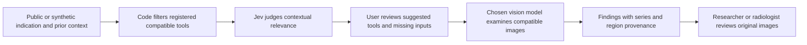

# Jev, vision models and contextual imaging-tool selection

Date: 2026-09-22. Status: researched recommendation, not an implemented or clinically validated feature. The user's example illustrates contextual tool matching. The images in that illustration are not diagnostic input for this assessment. The next implementation proposed is [Review evidence with Jev](../../docs/superpowers/specs/2026-09-22-jev-sidebar-evidence-review-design.md).

## What each model can do

Jev 1.13 accepts text/structured text and returns typed judgments. It has no image, audio or video input. A vision model must examine pixels and produce candidate findings/regions first. Jev can classify the resulting text or help select the appropriate tool, but cannot independently confirm a lesion that only the vision model has seen. Multiple models agreeing on generated descriptions are not independent pixel validation. [TypeSafe models](https://docs.typesafe.ai/models)

For the illustrated workflow, prefer **contextual tool suggestions** before general anomaly detection. Known rules should first exclude incompatible tools. Jev can judge the semantic relevance of the remaining tools against the stated question and prior-report context. This is an application of the vendor's skill-suggestion pattern; its published general-agent demonstration does not validate radiology performance. [Skill suggestion cookbook](https://docs.typesafe.ai/cookbooks/skill_suggestion)

## Applied to the illustration

| Context supplied | Candidate capability to consider | Required compatibility check |
| --- | --- | --- |
| Chest trauma | Appropriate fracture or thoracic finding detector | Exact detector-supported modality, anatomy, projection/protocol and intended population |
| Known nodule follow-up | Nodule detection/segmentation and prior-study matching | Suitable CT series; a real prior study is required to measure interval change |
| Dyspnea with a PE question | PE-specific detector when a compatible study exists | Exact contrast/protocol/series requirements; missing protocol information means compatibility is unknown |

The illustration's chest radiograph must not cause a CT-only PE tool to run just because the accompanying text suggests PE. For example, the FDA's cited BriefCase PE submission specifies CTPA images. That is evidence for that specific product's input boundary, not a claim about all PE products or a recommendation to acquire imaging. [FDA K190072](https://www.accessdata.fda.gov/cdrh_docs/pdf19/K190072.pdf)

## Recommended architecture for a later research prototype

A registered tool needs an actual endpoint, supported modality/protocol/format, model/version, task, output contract, processing location, availability and validation status. NVIDIA catalog presence supplies only an ID; it is insufficient to populate those fields. List unavailable capabilities honestly rather than pretending all catalog models are interchangeable radiology detectors.

Several tools can be relevant simultaneously. Independent Noul questions per compatible candidate can support multiple suggestions; Choice is appropriate for mutually exclusive selection with a no-match outcome. Missing required context remains an explicit unknown. Model confidence is not disease probability, permission to execute, or a universal acceptance threshold. Evaluate threshold/abstention rules on the intended cases. [Noul](https://docs.typesafe.ai/primitives/noul), [confidence guidance](https://docs.typesafe.ai/confidence)

Keep arithmetic, interval calculations, modality/protocol checks and authorization in code. Jev's documented weaknesses include numerical and multi-step reasoning. Evidence fields should identify which input supported a suggestion; any explanatory sentence must be an application template or separately attributed text, since Jev does not generate a free-form reasoning report. [Known limitations](https://docs.typesafe.ai/model-jaggedness/jev-1.13)

## Useful follow-on work, in recommended order

1. Contextual tool suggestions: recommend compatible registered capabilities, expose no-match/missing-input states, require user selection. Measure tool-selection accuracy against a simple deterministic routing baseline before adding automation.
2. Research result consistency: compare independently produced structured findings with a draft's stated findings, highlighting disagreement without editing or claiming pixel verification. Detect omitted caveats and conflicting textual assertions.
3. Dataset curation: suggest research cohorts from public/synthetic report text, such as follow-up intent or mention of a known finding. Keep expert reference labels separate from Jev's proposed labels.
4. Vision anomaly experiments: choose a task-specific detector or a medical vision foundation model, evaluate on held-out image cases, then test whether Jev's routing improves the whole workflow. Measure missed eligible findings, false suggestions, abstentions, latency, and tool failures—not just classification confidence.

MedGemma 1.5 is a candidate medical text/image development foundation, not a ready clinical detector: Google's card requires task-specific validation/adaptation and independent verification. No specific benchmark or multi-image capability is assumed without checking the exact variant and task. [Google model card](https://developers.google.com/health-ai-developer-foundations/medgemma/model-card)

NVIDIA VISTA-3D provides a more specific example: interactive anatomical segmentation on 3D CT in NIfTI format. That is different from detecting arbitrary disease or reading a screenshot; it would require its own volume conversion, inference and overlay/writeback integration. [NVIDIA VISTA-3D](https://docs.nvidia.com/nim/medical/vista3d/latest/advanced-usage.html)

Start these experiments with public/synthetic cases under the existing research/pilot boundary. Adding clinical context or new cloud image destinations is a separate data-handling and validation change. No part of this assessment enables the existing clinical-disabled cloud feature, claims NVIDIA developer credits cover a particular endpoint, or selects an unverified vision model for the user.
